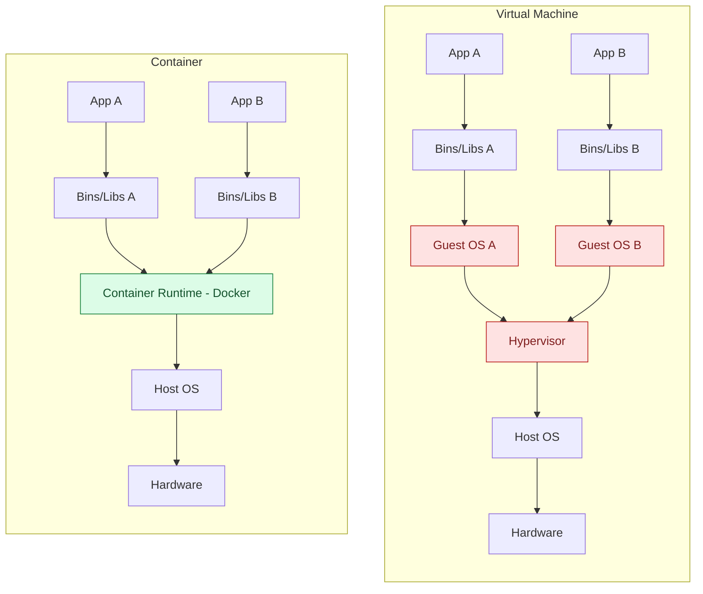
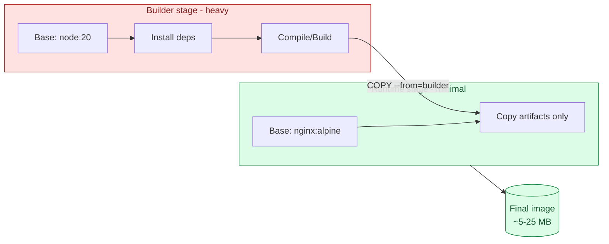
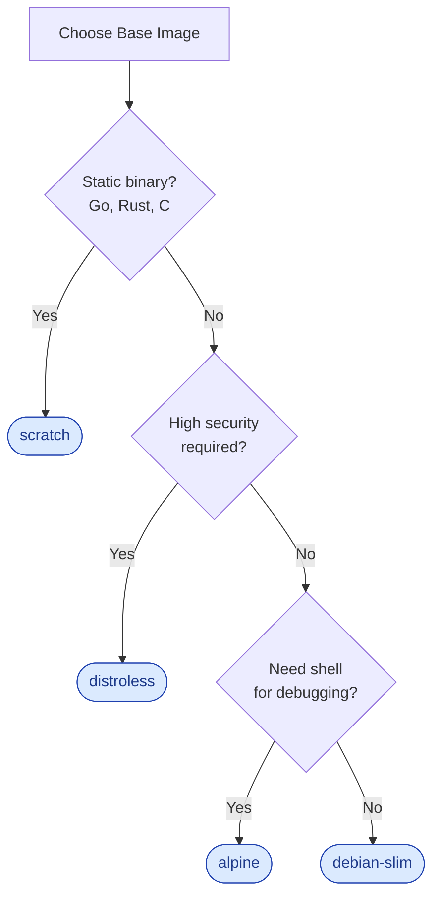
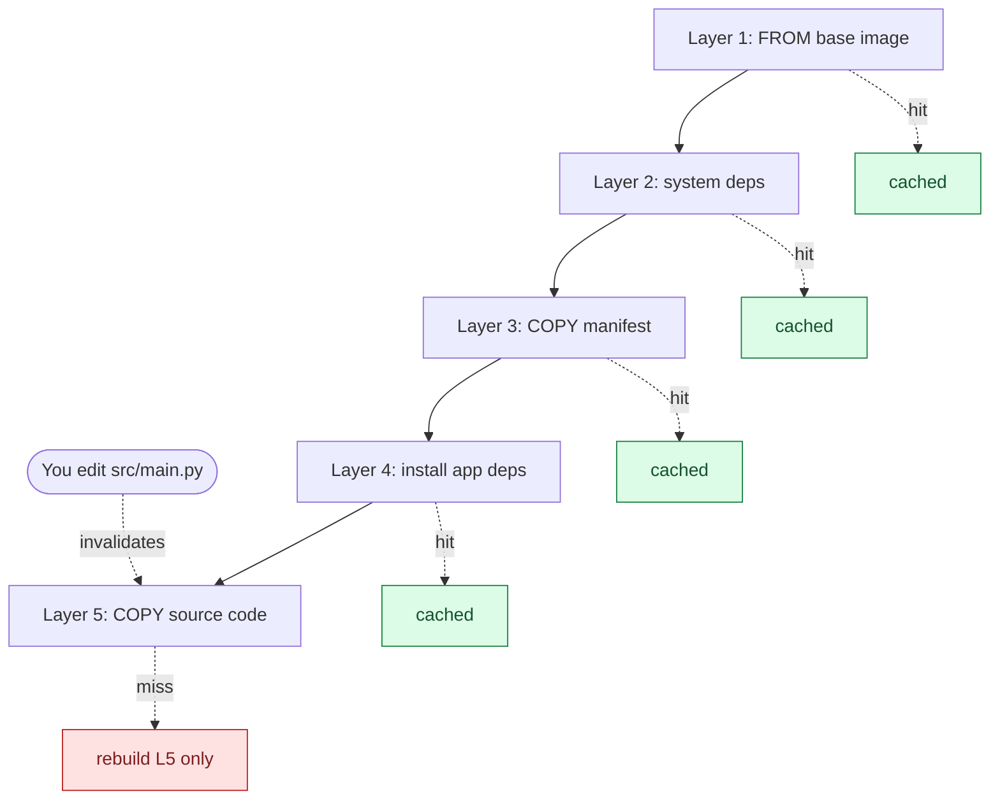
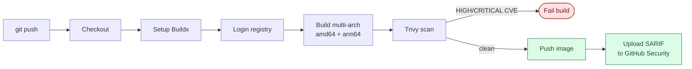

# 🐳 Docker Cookbook

> A comprehensive collection of best practices, optimization techniques, and common patterns for writing production-grade Dockerfiles.

---

## 📑 Table of Contents

- [0. Fundamentals](#0-fundamentals)
- [1. Multi-stage Builds](#1-multi-stage-builds)
- [2. Base Image Selection](#2-base-image-selection)
- [3. Layer Optimization](#3-layer-optimization)
- [4. Security Best Practices](#4-security-best-practices)
- [5. BuildKit Features](#5-buildkit-features)
- [6. Healthcheck Patterns](#6-healthcheck-patterns)
- [7. Signal Handling](#7-signal-handling)
- [8. OCI Labels](#8-oci-labels)
- [9. Size Optimization](#9-size-optimization-checklist)
  - [9.1 UPX Binary Compression](#91-upx-binary-compression)
  - [9.2 Brotli Static Compression](#92-brotli-static-compression)
- [10. Common Anti-patterns](#10-common-anti-patterns)
- [11. Multi-platform Builds](#11-multi-platform-builds)
- [12. CI/CD Integration](#12-cicd-integration)
- [13. Security Scanning](#13-security-scanning)
- [14. Advanced Caching](#14-advanced-caching-strategies)
- [15. Docker Compose Patterns](#15-docker-compose-patterns)

---

## 0. Fundamentals

### Container vs Virtual Machine



| Aspect | Virtual Machine | Container |
|--------|-----------------|-----------|
| **Isolation** | Full (separate kernel) | Process-level (shared kernel) |
| **Size** | GBs (includes OS) | MBs (app + dependencies only) |
| **Startup** | Minutes | Seconds/Milliseconds |
| **Performance** | ~5-10% overhead | Near-native |
| **Density** | 10-100 VMs/server | 100-1000 containers/server |

**💡 Why containers?**
- **Portability**: "Works on my machine" → "Works everywhere"
- **Efficiency**: Share host kernel, no duplicate OS
- **Speed**: Start in seconds, not minutes
- **Immutability**: Same image = same behavior always

### Docker Image Layers

Docker images are built from stacked **layers**:

```
┌─────────────────────────────────────────────────────────────┐
│                    Container (Read-Write)                   │
├─────────────────────────────────────────────────────────────┤
│ Layer 5: COPY . . (Source code)                      [2MB]  │ ← Changes frequently
├─────────────────────────────────────────────────────────────┤
│ Layer 4: RUN npm install (Dependencies)              [80MB] │
├─────────────────────────────────────────────────────────────┤
│ Layer 3: COPY package*.json . (Manifest)             [1KB]  │
├─────────────────────────────────────────────────────────────┤
│ Layer 2: RUN apt-get install (System deps)           [50MB] │
├─────────────────────────────────────────────────────────────┤
│ Layer 1: FROM node:20-alpine (Base image)            [50MB] │ ← Changes rarely
└─────────────────────────────────────────────────────────────┘
```

**💡 Why are layers important?**

1. **Caching**: Docker caches each layer. If a layer hasn't changed → reuse cache.
2. **Sharing**: Multiple images can share the same base layers.
3. **Efficiency**: Push/pull operations only transfer new/changed layers.

**⚠️ Key Principles:**
- Layers are additive; you cannot "delete" data in a subsequent layer to reduce size (it only hides it).
- Order matters: Put stable layers first, volatile layers last.
- Each RUN, COPY, ADD creates a new layer (though recent Docker versions optimize RUN instructions).

### Union Filesystem (OverlayFS)

Docker uses a **Union Filesystem** to stack layers:

```
┌─────────────────────────────────────────────────────────────┐
│                    Merged View (Container sees)             │
│  /app/index.js, /node_modules/*, /etc/*, /usr/*             │
└─────────────────────────────────────────────────────────────┘
                              ▲
                              │ Union Mount
┌─────────────────────────────────────────────────────────────┐
│ Upper Layer (Container - Read/Write)                        │
│  /app/logs/app.log (new file)                               │
├─────────────────────────────────────────────────────────────┤
│ Lower Layers (Image - Read-Only)                            │
│  Layer N: /app/index.js                                     │
│  Layer 2: /node_modules/*                                   │
│  Layer 1: /etc/*, /usr/*, /bin/*                            │
└─────────────────────────────────────────────────────────────┘
```

**💡 Key concepts:**
- **Lower layers**: Read-only, from the image.
- **Upper layer**: Read-write, contains runtime changes.
- **Copy-on-Write**: Modifying a file from a lower layer copies it to the upper layer first.

### OCI Standard (Open Container Initiative)

**What is OCI?**
An open governance structure for container formats and runtimes.

```
┌─────────────────────────────────────────────────────────────┐
│                    OCI Image Specification                  │
├─────────────────────────────────────────────────────────────┤
│  Image Manifest     → Layers and config description         │
│  Image Config       → Metadata (env, cmd, labels)           │
│  Filesystem Layers  → The tar.gz layer blobs                │
└─────────────────────────────────────────────────────────────┘
```

**💡 Why OCI matters?**
- **Portability**: Build with Docker, run with Podman, containerd, CRI-O, etc.
- **Security**: Standardized scanning, signing, and verification.
- **Ecosystem**: Tools like Trivy, Buildah, Skopeo work across all OCI images.

### BuildKit vs Legacy Builder

| Feature | Legacy Builder | BuildKit |
|---------|----------------|----------|
| **Parallelism** | Sequential stages | ✅ Parallel builds |
| **Cache** | Basic layer cache | ✅ Advanced (mounts, registry) |
| **Secrets** | ❌ Not supported | ✅ `--mount=type=secret` |
| **SSH** | ❌ Not supported | ✅ `--mount=type=ssh` |
| **Output** | Verbose | ✅ Rich progress UI |
| **Multi-platform** | ❌ Separate builds | ✅ `--platform` flag |

**Enable BuildKit:**
```bash
# Environment variable
export DOCKER_BUILDKIT=1

# Or in Dockerfile syntax
# syntax=docker/dockerfile:1.7
```

**💡 BuildKit should be default** - Faster, more features, no downsides.

### Why Image Size Matters?

```
┌─────────────────────────────────────────────────────────────┐
│              Image Size Impact                              │
├─────────────────────────────────────────────────────────────┤
│  📦 Storage Cost     → Larger image = more $/GB             │
│  🚀 Deploy Speed     → Larger image = slower pull           │
│  🔒 Attack Surface   → More packages = more CVEs            │
│  💰 Bandwidth Cost   → Multiply by number of deployments    │
└─────────────────────────────────────────────────────────────┘
```

**Real-world Example:**

| Scenario | 500MB Image | 50MB Image |
|----------|-------------|------------|
| Pull time (100Mbps) | 40 seconds | **4 seconds** |
| Storage (100 replicas) | 50 GB | **5 GB** |
| CVE count (typical) | 100+ | **10-20** |

**💡 Rule of thumb:**
- Development: Size is less critical, prioritize convenience.
- Production: Minimal size, security first.

---

## 1. Multi-stage Builds

Multi-stage builds allow you to separate the build environment from the runtime environment, significantly reducing the final image size.



### Basic Pattern

```dockerfile
# Stage 1: Builder
FROM node:20-alpine AS builder
WORKDIR /app
COPY package*.json ./
RUN npm ci
COPY . .
RUN npm run build

# Stage 2: Runtime
FROM nginx:alpine
COPY --from=builder /app/dist /usr/share/nginx/html
```

### When to use multiple stages?

| Stages | Use Case |
|--------|----------|
| 2 stages | Build + Runtime (most common) |
| 3 stages | Build + Test + Runtime |
| 4+ stages | Build + Deps + Compression + Runtime |

### Tips

- Name your stages with `AS <name>` for readability.
- Copy only what is necessary from the builder stage.
- You can copy from multiple different stages.

---

## 2. Base Image Selection

### Base Image Comparison

| Base Image | Size | Pros | Cons | Best For |
|------------|------|------|------|----------|
| **Alpine** | ~5MB | Tiny, has package manager | Uses musl libc (potential incompatibility) | Simple apps, tools |
| **Debian Slim** | ~25MB | glibc, stable, many packages | Larger than Alpine | Python, Node.js |
| **Distroless** | ~2-20MB | Extremely secure, no shell | Hard to debug, no package manager | Production, security-critical |
| **Scratch** | 0MB | Minimum possible | Must copy everything manually | Static binaries (Go, Rust) |
| **Ubuntu** | ~70MB | Full ecosystem, easy debug | Large | Development, legacy apps |

### Decision Tree



### Image Pinning

**❌ Don't:**
```dockerfile
FROM python:3.13
```

**✅ Do:**
```dockerfile
FROM python:3.13-alpine@sha256:abc123...
```

Reason: Digests ensure reproducible builds and prevent supply chain attacks (e.g., tag mutation).

---

## 3. Layer Optimization

### Layer Caching Principles

Docker caches each layer. If one layer changes, all subsequent layers must be rebuilt.



**Order by frequency of change (Least → Most):**

```dockerfile
# 1. Base image (rarely changes)
FROM python:3.13-slim

# 2. System dependencies
RUN apt-get update && apt-get install -y curl

# 3. App dependencies (changes when adding packages)
COPY requirements.txt .
RUN pip install -r requirements.txt

# 4. Source code (changes frequently)
COPY . .
```

### Merge RUN Commands

**❌ Multiple layers:**
```dockerfile
RUN apt-get update
RUN apt-get install -y curl
RUN apt-get clean
```

**✅ Single layer:**
```dockerfile
RUN apt-get update && \
    apt-get install -y --no-install-recommends curl && \
    rm -rf /var/lib/apt/lists/*
```

### .dockerignore

Always create a `.dockerignore` file:

```
node_modules/
.git/
*.md
.env*
tests/
__pycache__/
*.pyc
.pytest_cache/
coverage/
dist/
build/
```

---

## 4. Security Best Practices

### 4.1 Non-root User

**Always run containers as a non-root user:**

```dockerfile
# Create user
RUN addgroup -g 1000 -S appgroup && \
    adduser -u 1000 -S appuser -G appgroup

# Ownership
COPY --chown=appuser:appgroup . .

# Switch user
USER appuser
```

### 4.2 Minimal Permissions

```dockerfile
# Read + Execute only, no Write permission
RUN chmod -R 550 /app
```

### 4.3 No Secrets in Image

**❌ NEVER DO THIS:**
```dockerfile
ENV API_KEY=supersecret
COPY .env .
```

**✅ Use build-time secrets (BuildKit):**
```dockerfile
RUN --mount=type=secret,id=api_key \
    cat /run/secrets/api_key > /app/.config
```

### 4.4 Scan for Vulnerabilities

```bash
# Using Trivy
trivy image myimage:latest

# Or Docker Scout
docker scout cves myimage:latest
```

---

## 5. BuildKit Features

Enable BuildKit:
```bash
export DOCKER_BUILDKIT=1
```

Or in Dockerfile:
```dockerfile
# syntax=docker/dockerfile:1.7
```

### 5.1 Cache Mounts

Speed up builds by caching dependencies:

```dockerfile
# Node.js / pnpm
RUN --mount=type=cache,id=pnpm,target=/pnpm/store \
    pnpm install --frozen-lockfile

# Python / pip
RUN --mount=type=cache,target=/root/.cache/pip \
    pip install -r requirements.txt

# Java / Gradle
RUN --mount=type=cache,target=/root/.gradle \
    ./gradlew build
```

### 5.2 Bind Mounts

Access files without copying them creates no layer:

```dockerfile
RUN --mount=type=bind,source=package.json,target=package.json \
    npm install
```

### 5.3 Secret Mounts

```dockerfile
RUN --mount=type=secret,id=npmrc,target=/root/.npmrc \
    npm install
```

Build command:
```bash
docker build --secret id=npmrc,src=.npmrc .
```

---

## 6. Healthcheck Patterns

### Basic HTTP Check

```dockerfile
HEALTHCHECK --interval=30s --timeout=3s --start-period=10s --retries=3 \
    CMD curl -f http://localhost:8080/health || exit 1
```

### Lightweight Check (no curl required)

```dockerfile
# Python
HEALTHCHECK CMD python -c "import http.client; c=http.client.HTTPConnection('localhost', 8080); c.request('GET', '/health'); exit(0 if c.getresponse().status==200 else 1)"

# Using wget
HEALTHCHECK CMD wget --quiet --tries=1 --spider http://localhost:8080/health || exit 1
```

### Config Options

| Option | Description | Value |
|--------|-------------|-------|
| `--interval` | Frequency of check | 30s |
| `--timeout` | Wait time for response | 3s |
| `--start-period` | Init grace period | 10s-60s |
| `--retries` | Failures before unhealthy | 3 |

---

## 7. Signal Handling

### STOPSIGNAL

```dockerfile
STOPSIGNAL SIGTERM
```

### Init System (tini)

Solves zombie processes and signal forwarding issues:

```dockerfile
RUN apk add --no-cache tini
ENTRYPOINT ["/sbin/tini", "--"]
CMD ["node", "server.js"]
```

### Exec Form vs Shell Form

**✅ Exec form (recommended):**
```dockerfile
CMD ["node", "server.js"]
# PID 1 = node process, receives signals directly
```

**❌ Shell form:**
```dockerfile
CMD node server.js
# PID 1 = /bin/sh, node is subprocess, does not receive SIGTERM
```

---

## 8. OCI Labels

Standard metadata for container images:

```dockerfile
LABEL org.opencontainers.image.title="My App" \
      org.opencontainers.image.description="Description here" \
      org.opencontainers.image.version="1.0.0" \
      org.opencontainers.image.created="2025-01-01T00:00:00Z" \
      org.opencontainers.image.revision="abc123" \
      org.opencontainers.image.source="https://github.com/user/repo" \
      org.opencontainers.image.licenses="MIT" \
      org.opencontainers.image.authors="Author <email@example.com>"
```

### Dynamic Labels (build-time)

```dockerfile
ARG VERSION
ARG BUILD_DATE
ARG VCS_REF

LABEL org.opencontainers.image.version=$VERSION \
      org.opencontainers.image.created=$BUILD_DATE \
      org.opencontainers.image.revision=$VCS_REF
```

Build command:
```bash
docker build \
  --build-arg VERSION=1.0.0 \
  --build-arg BUILD_DATE=$(date -u +"%Y-%m-%dT%H:%M:%SZ") \
  --build-arg VCS_REF=$(git rev-parse --short HEAD) \
  .
```

---

## 9. Size Optimization Checklist

### ✅ Optimization Checklist

- [ ] Use multi-stage builds
- [ ] Choose appropriate base image (alpine/slim/distroless)
- [ ] Pin image versions with digests
- [ ] Merge RUN commands and clean up in the same layer
- [ ] Clear cache after install (`rm -rf /var/cache/apk/*`)
- [ ] Use `.dockerignore` strictly
- [ ] Do not install unnecessary docs, man pages, locales
- [ ] Strip debug symbols (`strip --strip-all binary`)
- [ ] Compress binary with UPX (if applicable)
- [ ] Remove source maps, test files in production

### Check Size

```bash
# View layer sizes
docker history myimage:latest

# Analyze with dive
dive myimage:latest
```

### 9.1 UPX Binary Compression

[UPX](https://upx.github.io/) compresses executable binaries while keeping them functional, reducing size by ~50-70%.

```dockerfile
FROM alpine:3.21 AS compressor

RUN apk add --no-cache upx

# Compress binary
COPY --from=builder /app/server /server
RUN upx --best --lzma /server
```

**Compression levels:**

| Level | Command | Ratio | Speed | Use Case |
|-------|---------|-------|-------|----------|
| Fast | `upx -1` | 40% | Fast | Development |
| Default | `upx` | 55% | Medium | General |
| Best | `upx --best` | 65% | Slow | Production |
| **Ultra** | `upx --best --lzma` | **70%** | Very Slow | Size-critical |

**Notes**:
- Slight startup time overhead due to decompression.
- Some antivirus software might flag UPX-compressed binaries.
- Not applicable for shared libraries (.so).

### 9.2 Brotli Static Compression

Brotli offers ~20% better compression than gzip and is supported by most browsers.

```dockerfile
FROM alpine:3.21 AS compressor

RUN apk add --no-cache brotli gzip

COPY --from=builder /app/dist ./dist

# Parallel compression: both gzip and brotli
RUN find dist -type f \( \
        -name "*.html" -o \
        -name "*.css" -o \
        -name "*.js" -o \
        -name "*.json" -o \
        -name "*.svg" \
    \) -print0 | xargs -0 -P$(nproc) -I {} sh -c 'gzip -9 -k "{}" && brotli -q 11 "{}"'
```

**Nginx config for Brotli:**

```nginx
# With ngx_brotli module
brotli on;
brotli_static on;
brotli_types text/plain text/css application/json application/javascript;
```

**Compression comparison:**

| Method | Ratio | Decompression Speed | Browser Support |
|--------|-------|---------------------|-----------------|
| None | 0% | - | 100% |
| Gzip-9 | 60-70% | Very Fast | 100% |
| **Brotli-11** | **70-80%** | Fast | 95%+ |

---

## 10. Common Anti-patterns

### ❌ Anti-pattern 1: Running as root

```dockerfile
# BAD - defaults to root
CMD ["node", "server.js"]
```

### ❌ Anti-pattern 2: Using latest tag

```dockerfile
# BAD - not reproducible
FROM node:latest
```

### ❌ Anti-pattern 3: Copying everything

```dockerfile
# BAD - copies node_modules, .git, etc.
COPY . .
```

### ❌ Anti-pattern 4: Hardcoded secrets

```dockerfile
# BAD
ENV DATABASE_PASSWORD=secret123
```

### ❌ Anti-pattern 5: Not cleaning up in same layer

```dockerfile
# BAD - creates bloated layer
RUN apt-get update && apt-get install -y curl
RUN rm -rf /var/lib/apt/lists/*  # Previous layer still has the cache
```

### ❌ Anti-pattern 6: Installing unnecessary packages

```dockerfile
# BAD - vim, nano are not needed in production
RUN apt-get install -y curl vim nano htop
```

---

## 11. Multi-platform Builds

Build images for multiple architectures (amd64, arm64) simultaneously.

### Setup BuildX

```bash
# Create builder with multi-platform support
docker buildx create --name multibuilder --use
docker buildx inspect --bootstrap
```

### Build Multi-platform

```dockerfile
# Dockerfile automatically detects TARGETARCH, TARGETOS
ARG TARGETARCH
ARG TARGETOS

FROM --platform=$BUILDPLATFORM golang:1.22-alpine AS builder
ARG TARGETARCH
ARG TARGETOS

# Cross-compile for target platform
RUN GOOS=$TARGETOS GOARCH=$TARGETARCH go build -o /app
```

```bash
# Build and push for both amd64 and arm64
docker buildx build \
    --platform linux/amd64,linux/arm64 \
    --tag myregistry/myapp:latest \
    --push \
    .
```

### Common Platforms

| Platform | Use Case |
|----------|----------|
| `linux/amd64` | Intel/AMD servers, most cloud VMs |
| `linux/arm64` | AWS Graviton, Mac M1/M2, Raspberry Pi 4 |
| `linux/arm/v7` | Raspberry Pi 3, older ARM devices |

---

## 12. CI/CD Integration



### GitHub Actions Workflow

```yaml
# .github/workflows/docker.yml
name: Build and Push Docker Image

on:
  push:
    branches: [main]
    tags: ['v*']
  pull_request:
    branches: [main]

env:
  REGISTRY: ghcr.io
  IMAGE_NAME: ${{ github.repository }}

jobs:
  build:
    runs-on: ubuntu-latest
    permissions:
      contents: read
      packages: write
      security-events: write

    steps:
      - name: Checkout
        uses: actions/checkout@v4

      - name: Set up Docker Buildx
        uses: docker/setup-buildx-action@v3

      - name: Login to Registry
        if: github.event_name != 'pull_request'
        uses: docker/login-action@v3
        with:
          registry: ${{ env.REGISTRY }}
          username: ${{ github.actor }}
          password: ${{ secrets.GITHUB_TOKEN }}

      - name: Extract metadata
        id: meta
        uses: docker/metadata-action@v5
        with:
          images: ${{ env.REGISTRY }}/${{ env.IMAGE_NAME }}
          tags: |
            type=ref,event=branch
            type=semver,pattern={{version}}
            type=sha,prefix=

      - name: Build and Push
        uses: docker/build-push-action@v5
        with:
          context: .
          platforms: linux/amd64,linux/arm64
          push: ${{ github.event_name != 'pull_request' }}
          tags: ${{ steps.meta.outputs.tags }}
          labels: ${{ steps.meta.outputs.labels }}
          cache-from: type=gha
          cache-to: type=gha,mode=max
          build-args: |
            VERSION=${{ github.ref_name }}
            BUILD_DATE=${{ github.event.head_commit.timestamp }}
            VCS_REF=${{ github.sha }}

      - name: Scan for vulnerabilities
        # Pin third-party actions to a commit SHA — `@master` / `@vX` tags can be
        # silently repointed (cf. the trivy-action and kics-github-action supply-chain
        # compromises). Dependabot updates the trailing `# vX.Y.Z` comment for you.
        uses: aquasecurity/trivy-action@ed142fd0673e97e23eac54620cfb913e5ce36c25 # v0.36.0
        with:
          image-ref: ${{ env.REGISTRY }}/${{ env.IMAGE_NAME }}:${{ github.sha }}
          format: 'sarif'
          output: 'trivy-results.sarif'

      - name: Upload scan results
        uses: github/codeql-action/upload-sarif@v2
        with:
          sarif_file: 'trivy-results.sarif'
```

### GitLab CI

```yaml
# .gitlab-ci.yml
stages:
  - build
  - scan
  - push

variables:
  DOCKER_TLS_CERTDIR: "/certs"
  IMAGE_TAG: $CI_REGISTRY_IMAGE:$CI_COMMIT_SHORT_SHA

build:
  stage: build
  image: docker:24
  services:
    - docker:24-dind
  before_script:
    - docker login -u $CI_REGISTRY_USER -p $CI_REGISTRY_PASSWORD $CI_REGISTRY
  script:
    - docker build -t $IMAGE_TAG .
    - docker push $IMAGE_TAG

scan:
  stage: scan
  image: aquasec/trivy:latest
  script:
    - trivy image --exit-code 1 --severity HIGH,CRITICAL $IMAGE_TAG
  allow_failure: true
```

---

## 13. Security Scanning

### Trivy (Recommended)

```bash
# Scan local image
trivy image myapp:latest

# Scan with exit code (for CI)
trivy image --exit-code 1 --severity HIGH,CRITICAL myapp:latest

# Scan Dockerfile
trivy config ./Dockerfile

# Output formats
trivy image --format json --output results.json myapp:latest
trivy image --format sarif --output results.sarif myapp:latest
```

### Docker Scout

```bash
# Enable Docker Scout
docker scout enroll

# Scan image
docker scout cves myapp:latest

# Quick overview
docker scout quickview myapp:latest

# Recommendations
docker scout recommendations myapp:latest
```

### Snyk

```bash
# Authenticate
snyk auth

# Scan image
snyk container test myapp:latest

# Monitor (continuous)
snyk container monitor myapp:latest
```

### Best Practices

| Practice | Recommendation |
|----------|----------------|
| Scan timing | Every build in CI |
| Severity threshold | Block HIGH/CRITICAL |
| Base image updates | Weekly or upon CVE warning |
| SBOM generation | Every release |

---

## 14. Advanced Caching Strategies

### Registry Cache

```bash
# Build with registry cache
docker buildx build \
    --cache-from type=registry,ref=myregistry/myapp:cache \
    --cache-to type=registry,ref=myregistry/myapp:cache,mode=max \
    -t myapp:latest .
```

### GitHub Actions Cache

```yaml
- name: Build with GHA cache
  uses: docker/build-push-action@v5
  with:
    cache-from: type=gha
    cache-to: type=gha,mode=max
```

### Local Cache

```bash
# Export cache to local directory
docker buildx build \
    --cache-from type=local,src=/tmp/.buildx-cache \
    --cache-to type=local,dest=/tmp/.buildx-cache-new,mode=max \
    -t myapp:latest .

# Rotate cache (CI)
rm -rf /tmp/.buildx-cache
mv /tmp/.buildx-cache-new /tmp/.buildx-cache
```

### Inline Cache

```dockerfile
# Enable inline cache metadata
# syntax=docker/dockerfile:1.7
FROM node:20-alpine

# Cache metadata is embedded into the image
# Allows cache-from directly from the image
```

```bash
docker buildx build \
    --cache-from type=registry,ref=myapp:latest \
    --build-arg BUILDKIT_INLINE_CACHE=1 \
    -t myapp:latest .
```

### Cache Mode Comparison

| Mode | Description | Size | Use Case |
|------|-------------|------|----------|
| `min` | Caches final layers only | Small | Quick builds |
| `max` | Caches all intermediate layers | Large | **CI/CD (recommended)** |

---

## 15. Docker Compose Patterns

### Basic Pattern

```yaml
# docker-compose.yml
# Note: `version:` key is obsolete in Compose v2+ and intentionally omitted.

services:
  app:
    build:
      context: .
      dockerfile: Dockerfile
      args:
        - VERSION=${VERSION:-latest}
    image: myapp:${VERSION:-latest}
    ports:
      - "8080:8080"
    environment:
      - NODE_ENV=production
    healthcheck:
      test: ["CMD", "curl", "-f", "http://localhost:8080/health"]
      interval: 30s
      timeout: 10s
      retries: 3
      start_period: 40s
    deploy:
      resources:
        limits:
          cpus: '1'
          memory: 512M
        reservations:
          cpus: '0.5'
          memory: 256M
    restart: unless-stopped
```

### Development Override

```yaml
# docker-compose.override.yml (auto-loaded)

services:
  app:
    build:
      target: development  # Use dev stage
    volumes:
      - .:/app:cached
      - /app/node_modules  # Exclude node_modules
    environment:
      - NODE_ENV=development
      - DEBUG=*
    ports:
      - "9229:9229"  # Debug port
```

### Production Override

```yaml
# docker-compose.prod.yml

services:
  app:
    build:
      target: production
    logging:
      driver: json-file
      options:
        max-size: "10m"
        max-file: "3"
    deploy:
      replicas: 3
      update_config:
        parallelism: 1
        delay: 10s
      restart_policy:
        condition: on-failure
```

Usage:
```bash
# Development
docker compose up

# Production
docker compose -f docker-compose.yml -f docker-compose.prod.yml up -d
```

---

## 📚 References

- [Docker Best Practices](https://docs.docker.com/develop/develop-images/dockerfile_best-practices/)
- [BuildKit Documentation](https://docs.docker.com/build/buildkit/)
- [Distroless Images](https://github.com/GoogleContainerTools/distroless)
- [OCI Image Spec](https://github.com/opencontainers/image-spec)
- [Docker BuildX](https://docs.docker.com/buildx/working-with-buildx/)
- [Trivy Scanner](https://trivy.dev/)
- [Docker Scout](https://docs.docker.com/scout/)

---

*Generated from docker-cookbook project*
