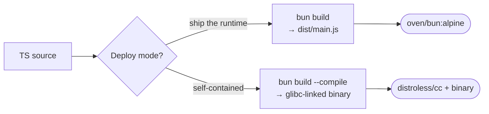

# 🥟 Bun Dockerfile Best Practices

> Guide to running Bun in production containers — bundled output or compiled standalone binaries.

---

## 1. Overview

| File | Description | Measured Size | Use Case |
|------|-------------|---------------|----------|
| `Dockerfile` | Alpine + bun runtime + bundled JS | **170 MB** | Standard server with HMR-like iteration speed |
| `Dockerfile.distroless` | `bun build --compile` → standalone binary on distroless/cc | **173 MB** | Compiled deploy, no Bun image needed |



---

## 2. Why Bun in Docker?

- **Single binary**: Bun itself is one ~80 MB executable — no Node + npm + pnpm dance.
- **`bun install` is fast**: 5-20x faster than npm in practice, and the binary lockfile (`bun.lockb`) is part of the speedup.
- **`bun build --compile`**: produces a fully standalone executable that embeds the runtime + your code. Ideal for `FROM scratch`.

---

## 3. Production setup

```dockerfile
FROM oven/bun:1.1.43-alpine AS builder
COPY package.json bun.lock* bun.lockb* ./
RUN bun install --frozen-lockfile --production
COPY src ./src
RUN bun build src/main.ts --target=bun --outdir=dist --minify
```

Tips:

- **Pin Bun version**: `oven/bun:1.1.43-alpine`, never `:latest`.
- **Use `--frozen-lockfile`**: fail the build if lockfile mismatches `package.json`.
- **Use `--production`** during install: skip dev deps automatically.
- **Mount the install cache**: `--mount=type=cache,target=/root/.bun/install/cache`.

---

## 4. Compile mode (`--compile`)

`bun build --compile` produces a single executable around 50-90 MB that contains:

- The Bun runtime (V8 fork)
- All your JS/TS bundled and minified
- Native module shims

The resulting binary still **dynamically links** to glibc and a few base libs, so it cannot run on truly empty `FROM scratch`. Use `gcr.io/distroless/cc-debian12:nonroot` instead — same security posture as scratch, but with the libraries Bun needs:

```dockerfile
# Build on glibc base so the binary matches the runtime
FROM oven/bun:1.1.43-slim AS builder
RUN bun build src/main.ts --compile --outfile=app

FROM gcr.io/distroless/cc-debian12:nonroot
COPY --from=builder /app/app /app
ENTRYPOINT ["/app"]
```

Tradeoffs:
- **Bigger than a bundled JS file** (the runtime is included).
- **Smaller than ship-the-runtime images** (no Bun toolchain).
- **Faster cold start** than `bun src/main.ts` because parsing is skipped.

---

## 5. Production Checklist

- [ ] Pin Bun version (avoid `oven/bun:latest`)
- [ ] `bun install --frozen-lockfile --production`
- [ ] Build with `--minify`
- [ ] Run as non-root (`USER bun` exists in `oven/bun` images, UID 1000)
- [ ] Healthcheck endpoint
- [ ] Handle SIGTERM in the JS code (no automatic shutdown in Bun.serve)
- [ ] Consider `--compile` for the smallest deploy unit
