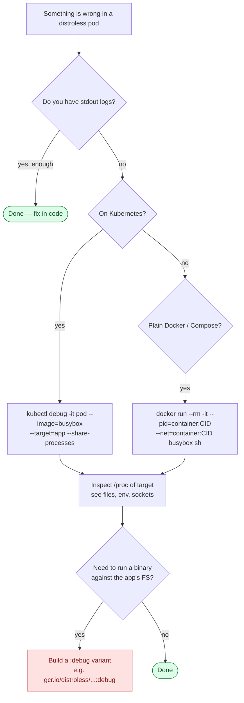

# Debugging distroless containers

Distroless images ship without a shell, package manager, or busybox utilities. Production-safe — but the first time something breaks, you'll discover that `kubectl exec -it pod sh` returns nothing.

This guide collects the techniques that actually work in 2026, ranked from least-invasive to most-invasive.



---

## 1. Make logs answer the question first

Most "I can't shell in" investigations should not need a shell. Before reaching for `kubectl debug`:

- Increase your app's log level via env var (`LOG_LEVEL=debug`, `DEBUG=*`, `RUST_LOG=trace`, etc.). All sample apps in this cookbook honour these.
- Dump request bodies / queries / stack traces on error paths.
- Add a `/debug/pprof` (Go), `/actuator/threaddump` (Spring), or `/debug` endpoint guarded by a header.

Adding 5 log lines is almost always faster than the techniques below.

---

## 2. Ephemeral debug containers (Kubernetes 1.25+)

`kubectl debug` injects a second container into a running pod that shares the target's PID + network namespaces. The target container is untouched.

```bash
# Share PID + network with the 'app' container in pod 'web-7d9'
kubectl debug -it web-7d9 \
  --image=busybox:1.37 \
  --target=app \
  --share-processes \
  -- sh
```

Inside the debug container:

```bash
# Target's running processes are visible
ps auxf

# Target's filesystem is at /proc/<pid>/root
ls /proc/1/root/app/

# Target's open files & sockets
ls /proc/1/fd/
cat /proc/1/net/tcp

# Target's env vars
xargs -0 -L1 -a /proc/1/environ
```

> **Why this works on distroless**: the distroless container itself still has no shell, but the debug container — which has all the tools — can see into it via `/proc/<pid>/root`.

### Variants for richer toolchains

| Tool | Image | When |
|------|-------|------|
| `busybox` | `busybox:1.37` | Basic shell + coreutils, ~4 MB |
| `nicolaka/netshoot` | `nicolaka/netshoot` | Networking: tcpdump, dig, mtr, iperf3 |
| `wbitt/network-multitool` | `wbitt/network-multitool` | Smaller netshoot alternative |
| `cgr.dev/chainguard/wolfi-base` | `cgr.dev/chainguard/wolfi-base` | apk available for ad-hoc installs |

---

## 3. Plain Docker / Compose

Same idea outside Kubernetes — start a sidecar container that shares namespaces:

```bash
# Find the container id
CID=$(docker ps -qf name=app)

# Attach a busybox sidecar
docker run --rm -it \
  --pid=container:$CID \
  --net=container:$CID \
  --volumes-from $CID \
  busybox:1.37 sh
```

Or with Compose, add a profile:

```yaml
services:
  app: { image: my-distroless-app:latest }
  debug:
    image: busybox:1.37
    profiles: [debug]
    pid: "service:app"
    network_mode: "service:app"
    command: ["sleep", "infinity"]
```

```bash
docker compose --profile debug up -d debug
docker compose exec debug sh
```

---

## 4. `:debug` tag — distroless with busybox

Every Google-published distroless image ships a `:debug` variant that includes BusyBox in `/busybox/`:

| Production | Debug |
|------------|-------|
| `gcr.io/distroless/static-debian12:nonroot` | `gcr.io/distroless/static-debian12:debug-nonroot` |
| `gcr.io/distroless/base-debian12:nonroot` | `gcr.io/distroless/base-debian12:debug-nonroot` |
| `gcr.io/distroless/nodejs22-debian12:nonroot` | `gcr.io/distroless/nodejs22-debian12:debug-nonroot` |

```dockerfile
# Only switch the base when debugging — keep prod images shell-less.
FROM gcr.io/distroless/static-debian12:debug-nonroot
COPY app /app
ENTRYPOINT ["/busybox/sh"]
```

Use sparingly — `:debug` images are ~10 MB heavier and defeat the "no shell = no RCE-via-shell" property.

---

## 5. Side-car BusyBox via multi-stage COPY

If you need exactly one binary (`ls`, `cat`, `wget`) in production without switching base images, copy it from BusyBox:

```dockerfile
FROM busybox:1.37-musl AS busybox

FROM gcr.io/distroless/static-debian12:nonroot
COPY --from=busybox /bin/busybox /busybox/busybox
COPY --from=busybox /bin/sh /busybox/sh
COPY app /app
# CMD untouched — your app still runs as PID 1.
# When debugging: `kubectl exec pod -- /busybox/sh`
```

This trades ~1 MB of image size for a permanent emergency hatch.

---

## 6. Memory dumps & profiles

You can grab dumps without a shell by attaching with the right tooling:

| Runtime | Command |
|---------|---------|
| JVM | `kubectl debug pod --image=eclipse-temurin:21-jdk --target=app -- jmap -dump:format=b,file=/tmp/heap.hprof 1` |
| Go | Hit your `pprof` HTTP endpoint from outside; no shell needed |
| Node | `kubectl port-forward` + `node --inspect=0.0.0.0:9229` |
| Python | `py-spy dump --pid 1` from a sidecar with `py-spy` installed |

---

## Quick reference

```bash
# K8s — most common
kubectl debug -it POD --image=busybox --target=CONTAINER --share-processes

# K8s with networking tools
kubectl debug -it POD --image=nicolaka/netshoot --target=CONTAINER --share-processes

# K8s, copy pod with shell prepended (read-only investigation)
kubectl debug POD --copy-to=POD-debug --container=app --image=ubuntu --share-processes -- bash

# Docker
docker run --rm -it --pid=container:$CID --net=container:$CID busybox sh

# Already have :debug image deployed?
kubectl exec -it POD -- /busybox/sh
```
