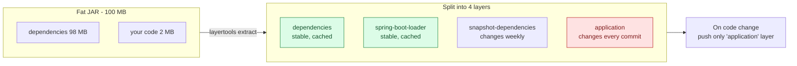
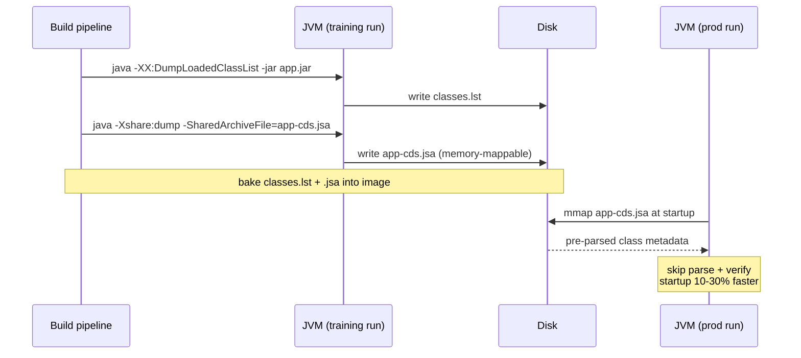

# ☕ Java/Spring Boot Dockerfile Best Practices

> Comprehensive guide to optimizing Dockerfiles for Java applications, specifically Spring Boot.

---

## 📑 Table of Contents

- [0. Java Fundamentals for Docker](#0-java-fundamentals-for-docker)
- [1. Overview](#1-overview)
- [2. Base Images for Java](#2-base-images-for-java)
- [3. Optimization Techniques](#3-optimization-techniques)
- [4. JVM Tuning for Containers](#4-jvm-tuning-for-containers)
- [5. Spring Boot Layertools](#5-spring-boot-layertools)
- [6. Custom JRE with jlink](#6-custom-jre-with-jlink)
- [7. Auto Dependency Update](#7-auto-dependency-update-cve-patching)
- [8. Healthcheck for Java](#8-healthcheck-for-java)
- [9. Comparison Table](#9-comparison-table)
- [10. Dockerfile Variants](#10-dockerfile-variants)
- [11. Production Checklist](#11-production-checklist)
- [12. GraalVM Native Image](#12-graalvm-native-image)
- [13. Docker Compose for Java](#13-docker-compose-for-java)
- [14. CI/CD for Java](#14-cicd-for-java)

---

## 0. Java Fundamentals for Docker

### JVM & Why it matters?

```
┌─────────────────────────────────────────────────────────────┐
│                    Java Application Stack                    │
├─────────────────────────────────────────────────────────────┤
│  Your Application Code (.java → .class)                     │
├─────────────────────────────────────────────────────────────┤
│  Third-party Libraries (JARs)                               │
├─────────────────────────────────────────────────────────────┤
│  Spring Boot Framework                                       │
├─────────────────────────────────────────────────────────────┤
│  Java Runtime Environment (JRE)                              │
│  ├── Java Class Library (rt.jar, modules)                   │
│  └── Java Virtual Machine (JVM)                             │
│      ├── JIT Compiler (HotSpot)                             │
│      ├── Garbage Collector                                   │
│      └── Class Loader                                        │
├─────────────────────────────────────────────────────────────┤
│  Operating System (Linux)                                    │
└─────────────────────────────────────────────────────────────┘
```

**💡 Why is JVM important in Docker?**
- JVM **does not automatically know** container memory limits (prior to Java 10).
- JVM tries to use **all available host RAM**, leading to OOM kills.
- Requires special flags: `UseContainerSupport`, `MaxRAMPercentage`.

### What is a Fat JAR?

Spring Boot packages applications as a **Fat JAR** (or Uber JAR):

```
app.jar (100MB)
├── BOOT-INF/
│   ├── classes/         ← Your compiled code (2MB)
│   │   └── com/myapp/...
│   └── lib/             ← ALL dependencies (98MB)
│       ├── spring-core-6.1.0.jar
│       ├── spring-boot-3.2.0.jar
│       ├── jackson-databind-2.15.0.jar
│       └── ... (hundreds of JARs)
├── META-INF/
│   └── MANIFEST.MF
└── org/springframework/boot/loader/
    └── JarLauncher.class
```

**💡 The problem with Fat JARs:**
- Every code change requires pushing the entire 100MB file again.
- Dependencies rarely change but are pushed repeatedly.
- **Solution**: Spring Boot Layertools (see section 5).



### Java Platform Module System (JPMS) - Needed for jlink

JPMS (Java 9+) splits the JDK into modular components:

```
java.base (required)     ← Core classes (String, Object, System)
java.logging             ← Logging API
java.sql                 ← JDBC
java.naming              ← JNDI
java.desktop             ← AWT/Swing (usually not needed)
java.xml                 ← XML processing
...
```

**💡 Why is JPMS important?**

A full JRE contains **all modules** (~200MB). With `jlink`, you select **only necessary modules**:

```bash
# Check required modules
jdeps --print-module-deps app.jar
# Output: java.base,java.logging,java.sql,java.naming

# Create custom JRE with only those modules
jlink --add-modules java.base,java.logging,java.sql,java.naming \
      --output custom-jre
# Result: ~40MB instead of ~200MB
```

### JVM Memory inside Containers

**⚠️ Critical Concept:**

```
┌─────────────────────────────────────────────────────────────┐
│              Container Memory (1GB limit)                    │
├─────────────────────────────────────────────────────────────┤
│  ┌─────────────────────────────────────────────────────┐    │
│  │              JVM Heap Memory                        │    │
│  │  -XX:MaxRAMPercentage=75 → Max ~750MB              │    │
│  └─────────────────────────────────────────────────────┘    │
│                                                              │
│  ┌──────────────────────┐  ┌──────────────────────────┐     │
│  │  Metaspace (~100MB)  │  │  Native Memory (~100MB)  │     │
│  │  (Class metadata)    │  │  (JIT, GC, Threads)      │     │
│  └──────────────────────┘  └──────────────────────────┘     │
│                                                              │
│  ┌──────────────────────────────────────────────────────┐   │
│  │  Remaining for OS/Other (~50MB buffer)               │   │
│  └──────────────────────────────────────────────────────┘   │
└─────────────────────────────────────────────────────────────┘
```

**💡 Why not set JVM Heap to 100% of RAM?**
- The JVM needs memory for: Metaspace, Garbage Collector, JIT compiler, native threads.
- If Heap = 100%, the container will OOM when native memory is allocated.

**Rule of thumb:**

| Container RAM | MaxRAMPercentage | Actual Heap |
|---------------|------------------|-------------|
| 512MB | 50% | ~256MB |
| 1GB | 70% | ~700MB |
| 2GB | 75% | ~1.5GB |
| 4GB+ | 80% | ~3.2GB |

### CDS (Class Data Sharing) - Faster Startup

CDS allows sharing class metadata across JVM instances (or runs):

```bash
# Step 1: Generate class list
java -Xshare:off -XX:DumpLoadedClassList=classes.lst -jar app.jar

# Step 2: Create archive
java -Xshare:dump -XX:SharedClassListFile=classes.lst \
     -XX:SharedArchiveFile=app-cds.jsa -jar app.jar

# Step 3: Use archive (faster startup)
java -Xshare:on -XX:SharedArchiveFile=app-cds.jsa -jar app.jar
```

**💡 CDS reduces startup time by 10-30%** by skipping class parsing and verification.



---

## 1. Overview

Java applications have unique characteristics:
- **JVM overhead**: Requires JRE/JDK to run.
- **Startup time**: Typically slower than compiled languages.
- **Memory**: JVM heap size needs careful configuration.
- **Fat JAR**: Spring Boot JARs can exceed 100MB.

### Optimization Targets

| Metric | Target |
|--------|--------|
| Image size | < 150MB (with custom JRE) |
| Startup time | < 10s |
| Memory footprint | Respects container limits |
| Security | 0 HIGH/CRITICAL CVEs |

---

## 2. Base Images for Java

| Base Image | Size | Description | Use Case |
|------------|------|-------------|----------|
| `eclipse-temurin:21-jre-alpine` | ~60MB | Minimum, standard | **Recommended** |
| `eclipse-temurin:21-jre` | ~200MB | Ubuntu/Debian based | Debugging / Compatibility |
| `gcr.io/distroless/java21-debian12` | ~220MB | Secure, no shell | High Security Production |
| `custom-jre` (jlink) | **~30-50MB** | Tailored to usage | **Extreme size optimization** |

---

## 3. Optimization Techniques

### 3.1 Multi-stage Build & Gradle Cache

```dockerfile
# Stage 1: Builder
FROM gradle:8.14-jdk21-alpine AS builder
WORKDIR /app
COPY gradlew build.gradle settings.gradle ./
COPY gradle/ gradle/
# Download dependencies (Cache layer)
RUN ./gradlew dependencies --no-daemon

COPY src/ src/
RUN ./gradlew bootJar --no-daemon
```

### 3.2 Spring Boot Layertools

Spring Boot separates dependencies and application code into layers.

```dockerfile
# Extract layers
RUN java -Djarmode=layertools -jar application.jar extract

# Copy separate layers
COPY --from=builder dependencies/ ./
COPY --from=builder spring-boot-loader/ ./
COPY --from=builder snapshot-dependencies/ ./
COPY --from=builder application/ ./
```

**Benefit:** Modifying code only updates the `application` layer (KB size), while `dependencies` (MB size) remain cached.

---

## 4. JVM Tuning for Containers

**Required flags for running in Docker:**

```dockerfile
ENV JAVA_OPTS="\
    -XX:+UseContainerSupport \
    -XX:MaxRAMPercentage=75.0 \
    -XX:+ExitOnOutOfMemoryError \
    -Djava.security.egd=file:/dev/./urandom \
    -Duser.timezone=UTC"

CMD java $JAVA_OPTS -jar application.jar
```

| Flag | Purpose |
|------|---------|
| `UseContainerSupport` | Makes JVM aware of Docker CPU/RAM limits |
| `MaxRAMPercentage` | Sets Heap as a % of container memory limit |
| `ExitOnOutOfMemoryError`| Restarts container on OOM instead of hanging |
| `java.security.egd` | Speeds up SecureRandom initialization (faster startup) |

---

## 5. Spring Boot Layertools

Detailed implementation of Layertools:

```dockerfile
FROM eclipse-temurin:21-jre-alpine

WORKDIR /app

# Assumes layers were extracted in previous stage
COPY --from=builder dependencies/ ./
COPY --from=builder spring-boot-loader/ ./
COPY --from=builder snapshot-dependencies/ ./
COPY --from=builder application/ ./

ENTRYPOINT ["java", "org.springframework.boot.loader.launch.JarLauncher"]
```

---

## 6. Custom JRE with jlink

Create a minimal JRE containing only required modules.

```dockerfile
FROM eclipse-temurin:21-jdk-alpine AS jre-builder

# Create custom JRE
RUN jlink \
    --add-modules java.base,java.logging,java.desktop,java.management,java.sql,java.naming,jdk.crypto.ec \
    --strip-debug \
    --no-man-pages \
    --no-header-files \
    --compress=2 \
    --output /javaruntime

# Runtime stage
FROM alpine:3.21
ENV JAVA_HOME=/opt/java/openjdk
ENV PATH="${JAVA_HOME}/bin:${PATH}"
COPY --from=jre-builder /javaruntime $JAVA_HOME
```

---

## 7. Auto Dependency Update (CVE Patching)

Automatically scan and update dependencies to patch CVEs during build.

### How it works?

1. Run `dependencyUpdates` to generate a report.
2. Parse report to find new versions.
3. Use `sed` to update `build.gradle`.
4. Build with patched versions.

### Dockerfile Implementation

```dockerfile
FROM gradle:8.14-jdk21-alpine AS builder
# ... (setup) ...

# Generate update report
RUN ./gradlew --no-daemon dependencyUpdates -Drevision=release

# Auto-update script (simplified logic)
RUN REPORT_FILE="build/dependencyUpdates/report.txt" && \
    # Logic to parse report and run sed ...
    echo "Version upgrade complete!"

RUN ./gradlew --no-daemon bootJar
```

---

## 8. Healthcheck for Java

### Spring Boot Actuator

```dockerfile
HEALTHCHECK --interval=30s --timeout=3s --retries=3 \
  CMD curl -f http://localhost:8080/actuator/health || exit 1
```

### Pure Java Healthcheck (No curl required)

Useful for Distroless / Scratch images.

```java
// HealthCheck.java
import java.net.URI;
import java.net.http.HttpClient;
import java.net.http.HttpRequest;
import java.net.http.HttpResponse;

public class HealthCheck {
    public static void main(String[] args) throws Exception {
        var client = HttpClient.newHttpClient();
        var request = HttpRequest.newBuilder()
                .uri(URI.create("http://localhost:8080/actuator/health"))
                .build();
        var response = client.send(request, HttpResponse.BodyHandlers.discarding());
        System.exit(response.statusCode() == 200 ? 0 : 1);
    }
}
```

Usage in Dockerfile:
```dockerfile
COPY HealthCheck.java .
RUN javac HealthCheck.java
HEALTHCHECK CMD ["java", "HealthCheck"]
```

---

## 9. Comparison Table

| Method | Image Size | Build Time | Complexity | Security | Use Case |
|--------|------------|------------|------------|----------|----------|
| JRE-alpine + JAR | 130-150MB | Fast | Low | Medium | Quick start |
| Layertools | 130-150MB | Medium | Medium | Medium | Optimized pushes |
| Custom JRE (jlink) | 80-100MB | Slow | High | High | Size-critical |
| Distroless | 220MB | Fast | Low | Very High | Security-critical |
| jlink + Distroless | 90-110MB | Slow | High | Very High | Production best |
| **jlink + UPX** | **60-80MB** | Very Slow | Very High | High | Extreme optimization |

---

## 10. Dockerfile Variants

This directory contains variants:

| File | Description | Measured Size | Use Case |
|------|-------------|---------------|----------|
| `Dockerfile` | Custom JRE (jlink) + Alpine | **171 MB** | Default choice |
| `Dockerfile.distroless` | Custom JRE + Distroless base-debian12 | **181 MB** | Security-critical |

> Distroless is slightly *larger* here than Alpine because `distroless/base-debian12` carries glibc + a few base libs; you save ~50 MB of OS userland vs full Debian but Alpine has even less.

---

## 11. Production Checklist

### ✅ Security

- [ ] Run as non-root user
- [ ] Use distroless or minimal base
- [ ] Pin image versions with SHA digests
- [ ] Update dependencies to patch CVEs
- [ ] JDK excluded from runtime (JRE only)

### ✅ Performance

- [ ] Set JVM container-aware flags
- [ ] Calculate `MaxRAMPercentage` appropriately
- [ ] Use G1GC for containers
- [ ] Enable CDS (Class Data Sharing) if applicable

### ✅ Size

- [ ] Multi-stage build
- [ ] Remove tests, docs, source files
- [ ] Use `jlink` for minimal JRE
- [ ] Use layertools for optimized layering

### ✅ Observability

- [ ] Healthcheck endpoint configured
- [ ] Proper STOPSIGNAL (SIGTERM)
- [ ] OCI labels for traceability
- [ ] Prometheus metrics (optional)

---

## 12. GraalVM Native Image

Compile Java into a native binary, starting up in ~50ms instead of 5-10s.

### Dockerfile with GraalVM

```dockerfile
# Stage 1: Build with GraalVM
FROM ghcr.io/graalvm/native-image:22 AS builder

WORKDIR /app
COPY . .
RUN ./gradlew nativeCompile --no-daemon

# Stage 2: Minimal runtime
FROM gcr.io/distroless/base-debian12:nonroot
COPY --from=builder /app/build/native/nativeCompile/app /app
USER nonroot
EXPOSE 8080
CMD ["/app"]
```

### Native vs JVM Comparison

| Metric | JVM | Native Image |
|--------|-----|--------------|
| Startup time | 5-10s | **~50ms** |
| Memory (idle) | 200-500MB | **50-100MB** |
| Image size | 100-200MB | **50-80MB** |
| Peak throughput | **Higher** | Lower ~10% |
| Build time | 1-2 mins | **10-20 mins** |

---

## 13. Docker Compose for Java

### Development Setup

```yaml
services:
  app:
    build:
      target: builder
    ports: ["8080:8080", "5005:5005"]
    environment:
      - JAVA_OPTS=-agentlib:jdwp=transport=dt_socket,server=y,suspend=n,address=*:5005
    volumes:
      - ./src:/app/src:cached
```

---

## 14. CI/CD for Java

### GitHub Actions

```yaml
- name: Set up JDK 21
  uses: actions/setup-java@v4
  with:
    java-version: '21'
    distribution: 'temurin'
    cache: gradle
```

---
