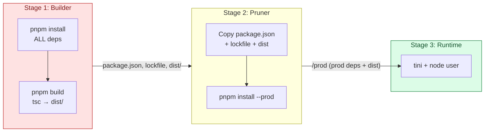

# 🟩 Node.js/Express Dockerfile Best Practices

> Comprehensive guide to optimizing Dockerfiles for Node.js Backend/API applications.

---

## 📑 Table of Contents

- [0. Node.js Fundamentals for Docker](#0-nodejs-fundamentals-for-docker)
- [1. Overview](#1-overview)
- [2. Base Images](#2-base-images)
- [3. Optimization Techniques](#3-optimization-techniques)
- [4. Security Patterns](#4-security-patterns)
- [5. Comparison](#5-comparison)
- [6. Docker Compose](#6-docker-compose)
- [7. CI/CD](#7-cicd)
- [8. Production Checklist](#8-production-checklist)

---

## 0. Node.js Fundamentals for Docker

### The Single Threaded Nature
Node.js runs on a single thread (Event Loop). In Docker, this means:
*   **CPU Limits**: A single container cannot use more than 1 CPU core effectively by default.
*   **Clustering**: To utilize multi-core systems, use Node's `cluster` module or run multiple replicas in Kubernetes/Docker Swarm.

### PID 1 and Signal Handling
Node.js is not designed to run as PID 1 (Init process). It does not properly handle signals (like `SIGTERM`, `SIGINT`) to gracefully shut down or reap zombie processes.
*   **Solution**: Always use `tini` or `dumb-init` as the entrypoint.
    ```dockerfile
    ENTRYPOINT ["/sbin/tini", "--"]
    CMD ["node", "app.js"]
    ```

### Node Modules Hell
`node_modules` can be massive and contain thousands of files.
*   **Best Practice**: Never `COPY` `node_modules` from host. Always install inside the container.
*   **Optimization**: Use `npm ci`, `yarn install --frozen-lockfile`, or `pnpm install --frozen-lockfile` for reproducible builds.
*   **Pruning**: Always remove `devDependencies` in the final production image.

### Pruning production dependencies
For a clean production tree without devDependencies, use a dedicated pruner
stage that runs `pnpm install --prod --frozen-lockfile` against the lockfile.
This pattern works for both single-package repos and pnpm workspaces.



```dockerfile
# In a separate pruner stage:
COPY --from=builder /app/package.json /app/pnpm-lock.yaml ./
COPY --from=builder /app/dist ./dist
RUN pnpm install --prod --frozen-lockfile
```

> `pnpm deploy --filter=.` is a workspace-only command and will fail in a
> single-package repo. The Dockerfiles in this directory use the
> install-based pattern above instead.

---

## 1. Overview

This directory contains optimized Dockerfiles for Node.js applications (Express, NestJS, Fastify, etc.).

| File | Description | Use Case |
|------|-------------|----------|
| `Dockerfile` | Standard Production | General purpose, balanced size/debuggability. |
| `Dockerfile.distroless` | Maximum Security | High compliance, banking/fintech, zero-shell environments. |

---

## 2. Base Images

### `node:22-alpine` (Recommended)
*   **Pros**: Smallest size (~40MB compressed), highly optimized.
*   **Cons**: Uses `musl` libc instead of `glibc`. Some native modules (like sharp, tensorflow) might need extra compilation steps.

### `node:22-slim` (Debian Slim)
*   **Pros**: Uses `glibc`, better compatibility with native modules.
*   **Cons**: Larger than Alpine.

### `gcr.io/distroless/nodejs` (Security)
*   **Pros**: No shell, no package manager, minimal attack surface.
*   **Cons**: Hard to debug (no `sh`, `ls`, `cat`), need custom healthcheck.

---

## 3. Optimization Techniques

### Multi-stage Builds
Separate build dependencies from runtime requirements.

```dockerfile
# Stage 1: Builder — full deps + build
FROM node:22-alpine AS builder
RUN pnpm install --frozen-lockfile && pnpm build

# Stage 2: Pruner — production-only deps in a clean tree
FROM node:22-alpine AS pruner
COPY --from=builder /app/package.json /app/pnpm-lock.yaml ./
COPY --from=builder /app/dist ./dist
RUN pnpm install --prod --frozen-lockfile

# Stage 3: Runtime
FROM node:22-alpine AS runtime
COPY --from=pruner /prod ./
```

### Dependency Caching with BuildKit
Speed up `npm/pnpm install` significantly.

```dockerfile
RUN --mount=type=cache,id=pnpm,target=/pnpm/store \
    pnpm install --frozen-lockfile
```

### Don't run as Root
Node.js official images come with a `node` user. Always switch to it.

```dockerfile
USER node
```

---

## 4. Security Patterns

### Handling Secrets
**NEVER** build secrets into the image.
*   ✅ **Good**: Inject via Environment Variables at runtime (`docker run -e API_KEY=...`).
*   ❌ **Bad**: `ENV API_KEY=secret` in Dockerfile.
*   ❌ **Bad**: `COPY .env .`

### Read-Only Filesystem
Harden security by making the root filesystem read-only.

```yaml
# docker-compose.yml
services:
  api:
    read_only: true
    tmpfs:
      - /tmp
```

---

## 5. Comparison

| Feature | Standard (Alpine) | Distroless |
|---------|-------------------|------------|
| **Base OS** | Alpine Linux | Debian 12 (Slimmest) |
| **Shell** | ✅ (`/bin/sh`) | ❌ (None) |
| **Package Manager** | ✅ (`apk`) | ❌ (None) |
| **Size** | ~80-100 MB | ~70-90 MB |
| **Security** | High | Very High |
| **Debuggability** | Easy | Hard |

---

## 6. Docker Compose

```yaml
services:
  api:
    build:
      context: .
      dockerfile: node/Dockerfile
    ports:
      - "3000:3000"
    environment:
      - NODE_ENV=development
    volumes:
      - ./src:/app/src # Hot reload
    command: pnpm dev
```

---

## 7. CI/CD

### GitHub Actions Example

```yaml
jobs:
  build-and-push:
    runs-on: ubuntu-latest
    steps:
      - uses: actions/checkout@v4
      
      - name: Set up Docker Buildx
        uses: docker/setup-buildx-action@v3
        
      - name: Login to DockerHub
        uses: docker/login-action@v3
        with:
          username: ${{ secrets.DOCKERHUB_USERNAME }}
          password: ${{ secrets.DOCKERHUB_TOKEN }}
          
      - name: Build and push
        uses: docker/build-push-action@v5
        with:
          context: ./node
          push: true
          tags: user/node-app:latest
          cache-from: type=gha
          cache-to: type=gha,mode=max
```

---

## 8. Production Checklist

- [ ] Use `NODE_ENV=production`.
- [ ] Run as non-root user (`USER node`).
- [ ] Implement `HEALTHCHECK`.
- [ ] Use `tini` or `dumb-init` for signal handling.
- [ ] Remove `devDependencies` (prune).
- [ ] Verify `package-lock.json` or `pnpm-lock.yaml` exists.
- [ ] Scan image for vulnerabilities (Trivy/Snyk).
