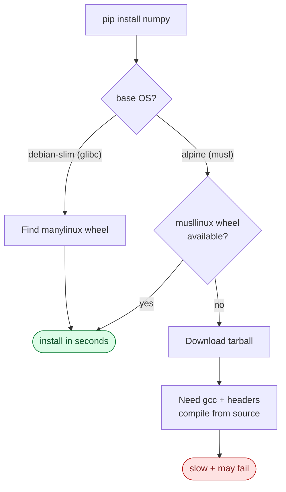

# 🐍 Python Dockerfile Best Practices

> Guide to optimizing Dockerfiles for Python applications, especially FastAPI/Flask.

---

## 📑 Table of Contents

- [0. Python Fundamentals for Docker](#0-python-fundamentals-for-docker)
- [1. Overview](#1-overview)
- [2. Base Images for Python](#2-base-images-for-python)
- [3. Package Managers](#3-package-managers)
- [4. Optimization Techniques](#4-optimization-techniques)
- [5. Distroless for Python](#5-distroless-for-python)
- [6. Environment Variables](#6-environment-variables)
- [7. Healthcheck for Python](#7-healthcheck-for-python)
- [8. Comparison Table](#8-comparison-table)
- [9. Production Checklist](#9-production-checklist)
- [10. Docker Compose](#10-docker-compose-for-python)
- [11. CI/CD](#11-cicd-for-python)

---

## 0. Python Fundamentals for Docker

### glibc vs musl (Alpine compatibility)

This is the biggest headache when using Python on Docker.

| Libc | OS | Characteristics | Python Compatibility |
|------|----|----------------|-----------------------|
| **glibc** | Debian, Ubuntu, Fedora | Linux Standard (GNU) | ✅ Best (Manylinux wheels) |
| **musl** | Alpine | Lightweight, clean code | ⚠️ Poor, requires source compilation |

**💡 Why does `pip install` fail on Alpine?**
Many Python libraries (numpy, pandas, psycopg2) are C extensions. PyPI provides pre-compiled binaries (wheels) for **glibc**.
- On **Debian/Slim**: pip downloads the wheel and runs immediately → Fast.
- On **Alpine**: pip cannot find a wheel for musl → Compiles from source → Requires GCC, headers → Slow & error-prone.



### What are Python Wheels?

Wheel (`.whl`) is a binary distribution format for Python packages.

```
numpy-1.26.0-cp311-cp311-manylinux_2_17_x86_64.whl
│            │     │     │             │
│            │     │     │             └── Architecture (amd64)
│            │     │     └──────────────── Platform (glibc compatible)
│            │     └────────────────────── ABI tag
│            └──────────────────────────── Python version (3.11)
└───────────────────────────────────────── Package name & version
```

**💡 Benefits of Wheels:**
- **Installation Speed**: No compilation, just unzip.
- **Size**: Build tools (gcc, make) are not needed in the runtime image.

### Why use Virtual Environments (venv) in Docker?

"Docker provides isolation, why do we need venv?"

1.  **System vs App**: Debian/Ubuntu comes with a system Python (`/usr/bin/python3`). If you use `pip install` directly, you might break system packages (Error: `ExternallyManagedEnvironment`).
2.  **Multi-stage COPY**: Easily copy all dependencies from builder to runtime by copying the `/opt/venv` folder.

```dockerfile
# Builder stage
RUN python -m venv /opt/venv
ENV PATH="/opt/venv/bin:$PATH"
RUN pip install -r requirements.txt

# Runtime stage
COPY --from=builder /opt/venv /opt/venv
ENV PATH="/opt/venv/bin:$PATH"
```

### GIL & Workers Configuration

Python (CPython) has a **Global Interpreter Lock (GIL)**, allowing only one thread to execute Python code at a time (prior to Python 3.13 no-GIL).

**💡 Implication for Containers:**
- A single-process container can only utilize **1 CPU core** for Python code.
- To utilize multi-core, use a **Process Manager** (Gunicorn/Uvicorn workers).

**Formula:**
`WORKERS = 2 * CPU_CORES + 1`

E.g., container limit `cpus: '2'`:
→ Set `WEB_CONCURRENCY=5` (or 4 workers).

---

## 1. Overview

Python applications have unique characteristics:
- **Interpreted language**: Requires Python runtime.
- **Dependencies**: Many packages have native extensions (C/C++).
- **Virtual environments**: Best practice for isolation.
- **libc compatibility**: Alpine (musl) vs Debian (glibc).

### Optimization Targets

| Metric | Target |
|--------|--------|
| Image size | < 150MB (slim), < 80MB (alpine) |
| Startup time | < 3s |
| Security | 0 HIGH/CRITICAL CVEs |
| Build time | < 2 mins with cache |

---

## 2. Base Images for Python

| Image | Bundled sample size | Cold start | Pros | Cons | Recommendation |
|-------|----|----|------|------|----------------|
| `python:3.13-alpine` (this Dockerfile) | **122 MB** | ~4.5 s | Smallest base, .pyc pre-compiled | musl libc | Default for pure Python |
| `gcr.io/distroless/base + custom Python` (Dockerfile.distroless) | **114 MB** | ~2.6 s | Secure, no shell, .pyc + `PYTHONOPTIMIZE=2` | Hard to debug | Production Security |
| `python:3.13-slim` | ~120MB | n/a | Compatible (glibc), standard | Slightly larger | Alternative if many native deps |

> The distroless variant is **faster** here because it bakes `.pyc` files at `PYTHONOPTIMIZE=2` (asserts + docstrings stripped) during build. The Alpine variant only does `PYTHONOPTIMIZE=0` precompilation — bigger files but faster runtime than parsing on every cold start.

---

## 3. Package Managers

### pip (Standard)
- Slow (single-threaded).
- Resolver can be slow.

### uv (Recommended)
- Written in Rust.
- **10-100x faster** than pip.
- Drop-in replacement (`uv pip install`).

```dockerfile
# Pin a specific uv version (avoid :latest)
COPY --from=ghcr.io/astral-sh/uv:0.5.11 /uv /usr/local/bin/uv

# Install deps into a venv (preferred over --system)
RUN python -m venv /opt/venv
ENV PATH="/opt/venv/bin:$PATH"
RUN --mount=type=cache,target=/root/.cache/uv \
    uv pip install -r requirements.txt
```

---

## 4. Optimization Techniques

### 4.1 Multi-stage Build Pattern

```dockerfile
FROM python:3.13-slim AS builder

WORKDIR /app
COPY requirements.txt .

# Create venv and install
RUN python -m venv /opt/venv
ENV PATH="/opt/venv/bin:$PATH"
RUN pip install -r requirements.txt

# Runtime
FROM python:3.13-slim
COPY --from=builder /opt/venv /opt/venv
ENV PATH="/opt/venv/bin:$PATH"
WORKDIR /app
COPY . .
ENTRYPOINT ["python", "main.py"]
```

### 4.2 Pre-compile Wheels

Build wheels in the builder stage to avoid installing GCC in runtime.

```dockerfile
# Builder
RUN pip wheel --no-cache-dir --wheel-dir /usr/src/app/wheels -r requirements.txt

# Runtime
COPY --from=builder /usr/src/app/wheels /wheels
RUN pip install --no-cache /wheels/*
```

### 4.3 Clean up pycache

Prevent `.pyc` files from being generated or remove them.

```dockerfile
ENV PYTHONDONTWRITEBYTECODE=1
```

Or remove manually:
```dockerfile
RUN find . -type d -name __pycache__ -exec rm -r {} +
```

### 4.4 Aggressive Optimization (Extreme Size Reduction)

Extreme optimization to minimize image size:

```dockerfile
FROM python:3.13-alpine AS builder

# ULTRA AGGRESSIVE optimization
RUN apk add --no-cache binutils && \
    # Strip ALL .so files
    find /install -type f \( -name '*.so*' -o -name '*.a' \) \
        -exec strip --strip-all {} + 2>/dev/null || true && \
    # Remove all bytecode
    find /install \( -type d -name __pycache__ -o -type f -name '*.py[co]' \) \
        -delete 2>/dev/null || true && \
    # Remove test/doc/examples
    find /install -type d \( -name tests -o -name doc -o -name examples \) \
        -prune -exec rm -rf {} + 2>/dev/null || true
```

### 4.5 PYTHONOPTIMIZE - Bytecode Optimization

```dockerfile
# Level 0: No optimization
# Level 1 (-O): Remove assert statements
# Level 2 (-OO): Remove assert + docstrings

ENV PYTHONOPTIMIZE=2
```

| Level | Flag | Effect | Size Reduction |
|-------|------|--------|----------------|
| 1 | `-O` | Remove asserts | ~5% |
| 2 | `-OO` | Remove asserts + docstrings | ~10-15% |

### 4.6 CVE Auto-fix during Build

Auto-patch CVEs by parsing `pyproject.toml` and upgrading vulnerable packages.

```dockerfile
# (Code example similar to original, using python script to parse toml)
```

---

## 5. Distroless for Python

### Multi-arch Distroless

When building for multiple architectures (amd64, arm64), copy correct shared libraries.

**Common shared libraries list:**

```dockerfile
ARG TARGETARCH

# Copy shared libraries sufficient to run Python in distroless
RUN if [ "$TARGETARCH" = "amd64" ]; then \
        LIBARCH="x86_64"; \
    elif [ "$TARGETARCH" = "arm64" ]; then \
        LIBARCH="aarch64"; \
    fi && \
    mkdir -p /lib/multi-arch && \
    cp /lib/${LIBARCH}-linux-gnu/libc.so.6 /lib/multi-arch/ && \
    # ... copy other libs
```

---

## 6. Environment Variables

| Variable | Value | Description |
|----------|-------|-------------|
| `PYTHONDONTWRITEBYTECODE` | `1` | Do not write `.pyc` to disk |
| `PYTHONUNBUFFERED` | `1` | Force stdout/stderr unbuffered |
| `PYTHONHASHSEED` | `random` | Prevent hash collision attacks |
| `PIP_NO_CACHE_DIR` | `off` | Do not use pip cache |
| `AIOHTTP_NO_EXTENSIONS` | `1` | Disable aiohttp extensions (speed vs compat) |

---

## 7. Healthcheck for Python

```dockerfile
HEALTHCHECK --interval=30s --timeout=3s \
  CMD python -c "import urllib.request; urllib.request.urlopen('http://localhost:8000/health')" || exit 1
```

---

## 8. Comparison Table

| Method | Size | Build Speed | Compatibility | Use Case |
|--------|------|-------------|---------------|----------|
| Slim (Standard) | 120MB | Fast | High | General Prod |
| Alpine | 50MB | Slow (compile) | Low | Pure Python |
| Distroless | 50MB | Medium | Medium | High Security |
| **Slim + uv + Strip** | **80MB** | **Very Fast** | **High** | **Best Balanced** |

---

## 9. Production Checklist

### ✅ Security

- [ ] Run as non-root user
- [ ] Dependencies pinned with hashes
- [ ] No secrets in environment variables
- [ ] Build-time secrets used for private pypi

### ✅ Performance

- [ ] `.pyc` generation disabled
- [ ] `uv` used for faster installs
- [ ] Multi-stage build implemented
- [ ] `.dockerignore` configured properly

### ✅ Observability

- [ ] `PYTHONUNBUFFERED=1` set
- [ ] Healthcheck endpoint accessible
- [ ] Graceful shutdown handled (SIGTERM)

---

## 10. Docker Compose for Python

### FastAPI Development Setup

```yaml
services:
  api:
    build: .
    command: uvicorn src.main:app --host 0.0.0.0 --port 8000 --reload
    volumes:
      - ./src:/app/src:cached
```

---

## 11. CI/CD for Python

### GitHub Actions

```yaml
- name: Install dependencies
  run: |
    pip install uv
    uv sync --dev
```

---
