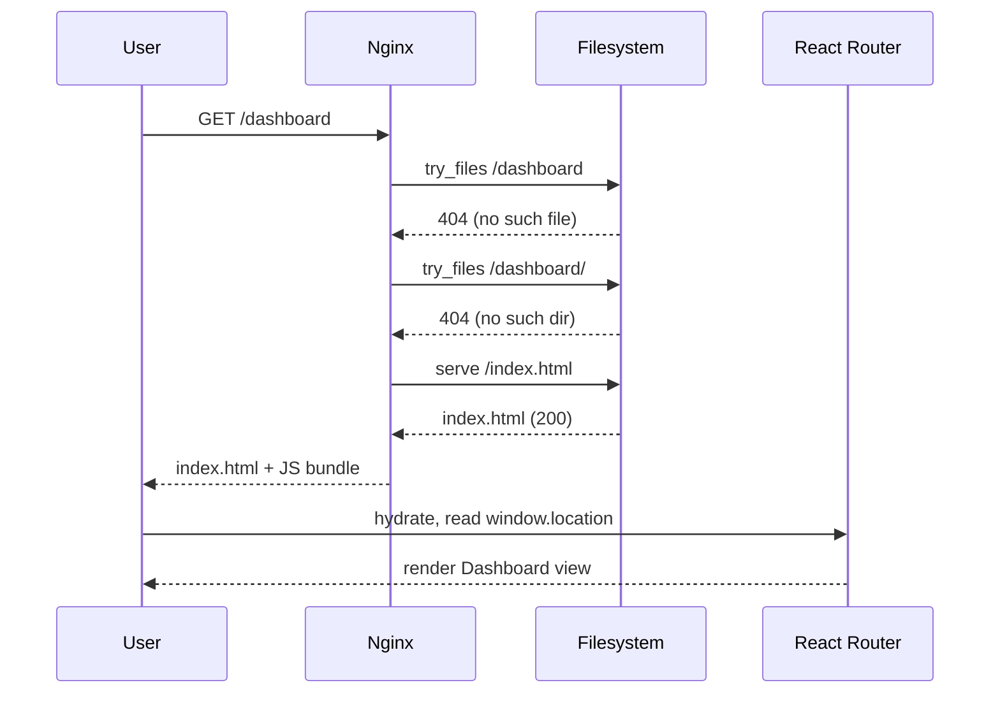
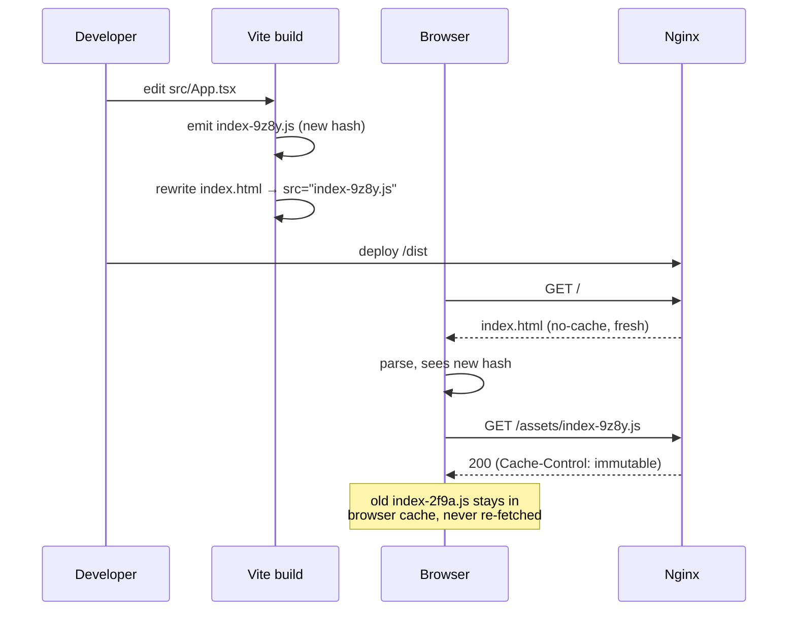

# ⚛️ React/Vite Dockerfile Best Practices

> Guide to optimizing Dockerfiles for React SPAs with Vite.

---

## 📑 Table of Contents

- [0. Web/React Fundamentals for Docker](#0-webreact-fundamentals-for-docker)
- [1. Overview](#1-overview)
- [2. Web Server Options](#2-web-server-options)
- [3. Node Package Managers](#3-node-package-managers)
- [4. Optimization Techniques](#4-optimization-techniques)
- [5. Nginx Configuration](#5-nginx-configuration)
- [6. Extreme Optimization: From Scratch](#6-extreme-optimization-from-scratch)
- [7. Comparison Table](#7-comparison-table)
- [8. Production Checklist](#8-production-checklist)
- [9. Docker Compose](#9-docker-compose-for-react)
- [10. CI/CD](#10-cicd-for-react)

---

## 0. Web/React Fundamentals for Docker

### Client-side Routing vs Server-side Routing

React uses **HTML5 History API** (`pushState`) to change URLs without reloading the page. However, the Web Server (Nginx) is unaware of this.

**The Problem:**
1. User visits `/dashboard`.
2. Nginx looks for `dashboard.html` or `dashboard/` directory.
3. Not found → Returns **404 Not Found**.

**The Solution (SPA Fallback):**
Configure Nginx to **always return index.html** if a file is not found.

```nginx
location / {
    try_files $uri $uri/ /index.html;
}
```



### HTTP Caching Strategy (Cache Control)

To optimize performance, aggressively cache assets but never cache `index.html`.

| File Type | Pattern | Cache Strategy | Why? |
|-----------|---------|----------------|------|
| **HTML** | `index.html` | `no-cache` / `max-age=0` | Users always get the latest version entry point. |
| **Assets** | `index-a1b2.js` | `public, max-age=31536000, immutable` | Filename contains a unique hash. If file changes → name changes → browser downloads new file. |

```nginx
# Cache forever for hashed assets
location ~* \.(js|css|png|jpg|svg)$ {
    expires 1y;
    add_header Cache-Control "public, immutable";
}

# No cache for index.html
location = /index.html {
    expires -1;
    add_header Cache-Control "no-cache";
}
```

### Content Hashing (Cache Busting)

Build tools like Vite automatically add hashes to filenames: `index-2f9a.js`.



### Gzip vs Brotli Compression

Compress text files (JS, CSS, HTML) to reduce network load.

| Algorithm | Compression Ratio | Speed | Browser Support |
|-----------|------------------|-------|-----------------|
| **Gzip** | Good (`-9`) | Very Fast | 99.9% |
| **Brotli** | **20% Better than Gzip** (`-11`) | Slower | 96% (All modern browsers) |

**Best Practice:**
1. **Pre-compress** during Docker build (utilizing build server CPU).
2. Use Nginx modules `gzip_static` and `brotli_static` to serve pre-compressed files.
3. Avoid spending Nginx runtime CPU on on-the-fly compression.

---

## 1. Overview

React applications are Single Page Applications (SPA):
- **Build output**: Static files (HTML, JS, CSS).
- **Runtime**: Only requires a web server to serve static files.
- **Size**: Build output is typically 1-5MB.
- **Routing**: Client-side routing requires fallback to index.html.

### Optimization Targets

| Metric | Target |
|--------|--------|
| Image size | < 20MB (nginx-alpine), < 5MB (scratch) |
| Time to First Byte | < 100ms |
| Build time | < 2 mins with cache |
| Lighthouse Score | 90+ |

---

## 2. Web Server Options

| Server | Size (Image) | Pros | Cons |
|--------|--------------|------|------|
| **Nginx** | ~20MB | Industry standard, powerful config | Slightly larger |
| **Caddy** | ~50MB | Auto HTTPS, simple config | Large binary |
| **BusyBox httpd** | ~5MB | Tiny, built-in Alpine | Very limited features |
| **Static Go Server**| ~2-5MB | Smallest, simple | Maintenance effort |

---

## 3. Node Package Managers

### npm vs yarn vs pnpm

| Manager | Speed | Disk Space | Docker Friendly |
|---------|-------|------------|-----------------|
| npm | Slow | High | ✅ Standard |
| yarn | Medium | Medium | ✅ Good |
| **pnpm** | **Fastest** | **Lowest** | ✅ **Best (via content-addressable store)** |

### pnpm Docker Setup

```dockerfile
ENV PNPM_HOME="/pnpm"
ENV PATH="$PNPM_HOME:$PATH"
RUN corepack enable

COPY package.json pnpm-lock.yaml ./
RUN --mount=type=cache,id=pnpm,target=/pnpm/store \
    pnpm install --frozen-lockfile
```

---

## 4. Optimization Techniques

### 4.1 Multi-stage Build

```dockerfile
# Stage 1: Build
FROM node:20-alpine AS builder
WORKDIR /app
COPY . .
RUN pnpm install && pnpm build

# Stage 2: Serve
FROM nginx:alpine
COPY --from=builder /app/dist /usr/share/nginx/html
```

### 4.2 Parallel Compression

Use `xargs` to compress files in parallel during build.

```bash
find dist -type f -name "*.js" | xargs -P 4 -I {} gzip -k {}
```

---

## 5. Nginx Configuration

**The essential `nginx.conf` for SPA:**

```nginx
server {
    listen 3000;
    root /usr/share/nginx/html;
    index index.html;

    # Gzip Settings
    gzip on;
    gzip_static on;
    gzip_types text/plain text/css application/json application/javascript;

    # Security Headers
    add_header X-Frame-Options "SAMEORIGIN";
    add_header X-Content-Type-Options "nosniff";

    # SPA Fallback
    location / {
        try_files $uri $uri/ /index.html;
    }

    # Cache Assets
    location ~* \.(js|css|png|jpg|jpeg|gif|ico)$ {
        expires 1y;
        add_header Cache-Control "public, immutable";
    }
}
```

---

## 6. Extreme Optimization: From Scratch

See [`Dockerfile.scratch`](./Dockerfile.scratch) for the full implementation.

### 6.1 UPX Binary Compression

[UPX](https://upx.github.io/) compresses the binary, maintaining functionality while reducing size by ~50-70%.

```dockerfile
FROM alpine:3.21 AS compressor
RUN apk add --no-cache upx
# ... compress nginx ...
RUN upx --best --lzma /nginx
```

### 6.2 Static C Healthcheck Binary

Healthcheck binary written in C, no curl/wget needed.

```c
// healthcheck.c (Connects to localhost:3000)
```

Compile static:
```dockerfile
RUN gcc -static -O2 -o /healthcheck healthcheck.c
RUN strip /healthcheck
# Result: ~20KB binary
```

### 6.3 Custom Nginx (Static Build + Scratch)

Compile Nginx as a static binary and run on `scratch`.

Result: **~5MB Docker Image running Nginx!**

---

## 7. Comparison Table

| Method | Measured Size | Build Complexity | Performance | Use Case |
|--------|---------------|------------------|-------------|----------|
| nginx:alpine | **74.4 MB** | Low | Excellent | Production standard |
| Custom nginx (scratch) | **4.3 MB** | High | Excellent | Size-critical |

---

## 8. Production Checklist

### ✅ Build Optimization

- [ ] Multi-stage build
- [ ] pnpm with cache mount
- [ ] Remove source maps, license files
- [ ] Pre-compress with gzip/brotli
- [ ] `.dockerignore` complete

### ✅ Nginx Configuration

- [ ] SPA fallback (try_files)
- [ ] gzip_static enabled
- [ ] Security headers
- [ ] Cache control for assets
- [ ] No cache for index.html

### ✅ Security

- [ ] Non-root user
- [ ] Pin base image version
- [ ] Do not expose source maps

---

## 9. Docker Compose for React

### Development Setup

```yaml
services:
  frontend:
    command: pnpm dev --host
    volumes:
      - .:/app:cached
```

---

## 10. CI/CD for React

### GitHub Actions + Lighthouse

```yaml
- name: Build and push
  uses: docker/build-push-action@v5
```

---
