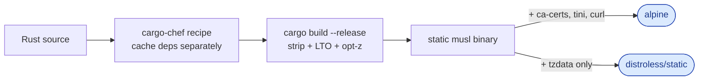
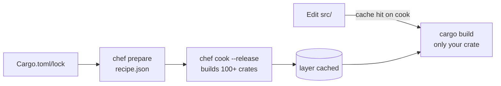

# 🦀 Rust Dockerfile Best Practices

> Guide to building production-grade Rust container images using cargo-chef caching and musl static linking.

---

## 1. Overview

| File | Description | Measured Size | Use Case |
|------|-------------|---------------|----------|
| `Dockerfile` | Alpine runtime + cargo-chef cached deps | **25.7 MB** | Default, debuggable |
| `Dockerfile.distroless` | distroless/static + static musl binary | **9.2 MB** | Production security |



---

## 2. Why cargo-chef?

A naive Rust Dockerfile invalidates the dependency layer every time *any* file in `src/` changes. With 100+ transitive crates, a 10-second source edit triggers a 5-minute recompile.

`cargo-chef` solves this by splitting the build into:

1. **`prepare`** — extract a `recipe.json` from `Cargo.toml` + `Cargo.lock` (cheap, runs every time).
2. **`cook`** — compile only the recipe (heavy, cached until lockfile changes).
3. **`build`** — finally compile your source against the pre-built deps.



The dep cook layer only invalidates when `Cargo.toml` or `Cargo.lock` changes. Typical iteration drops from minutes to seconds.

---

## 3. Release profile tuning

The `Cargo.toml` here sets aggressive size-oriented flags:

```toml
[profile.release]
strip = true       # remove symbols, ~20-40% smaller
opt-level = "z"    # optimise for size (vs "3" for speed)
lto = true         # link-time optimisation across crates
codegen-units = 1  # single codegen unit allows more inlining
panic = "abort"    # smaller, no unwinding tables
```

> Pick `opt-level = 3` if you care more about throughput than image size. For CPU-bound workloads, the size win from `"z"` is rarely worth the runtime hit.

---

## 4. musl vs glibc

Both Dockerfiles here use the `rust:*-alpine` base, which provides a musl toolchain by default. The resulting binary is **statically linked** and runs anywhere — including `FROM scratch` if you want zero filesystem.

Tradeoffs:

| | musl (Alpine) | glibc (Debian) |
|--|---------------|----------------|
| Binary | static, portable | dynamic, needs libc on target |
| Performance | ~5-15% slower on heavy memory workloads | baseline |
| Distroless target | `static-debian12` | `cc-debian12` (needs glibc) |
| Native deps | sometimes need `apk add` | usually have pkg available |

For typical web services, musl static is the better default. Switch to glibc only if you've profiled a real bottleneck.

---

## 5. Distroless static

Since Rust + musl produces a static binary, `gcr.io/distroless/static-debian12` is the ideal runtime — it carries only CA certs, /etc/passwd, and 65532:65532 as the default user. No libc, no shell, no package manager.

Tzdata is not bundled, so we copy `/usr/share/zoneinfo` from an Alpine stage.

---

## 6. Production Checklist

- [ ] Use `cargo-chef` for dependency caching
- [ ] Static musl build (`rust:*-alpine` toolchain)
- [ ] `strip = true`, `lto = true` in release profile
- [ ] Distroless static for production
- [ ] Healthcheck endpoint (HTTP `/health`)
- [ ] Graceful shutdown handles SIGTERM/SIGINT
- [ ] Scan binary with `cargo audit` in CI
